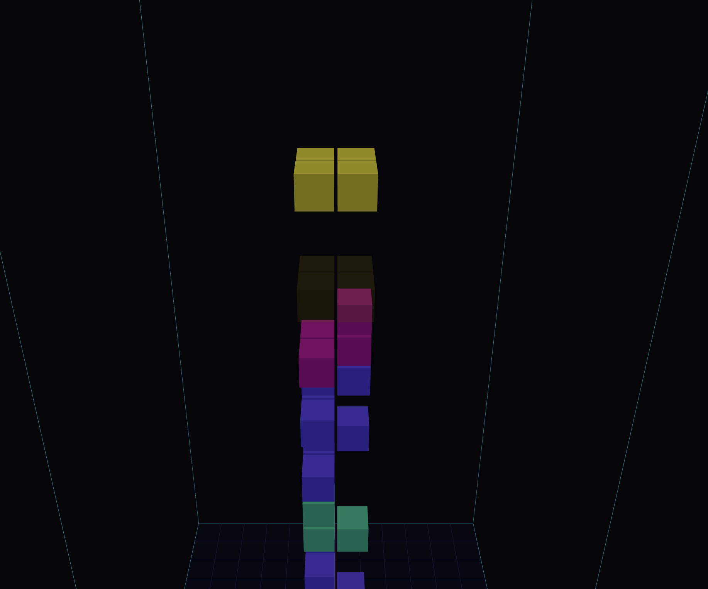

Build a 3D Tetris game with HTML, Three.js, and React.

**▶️ Live demo: [apotox.github.io/tetris_3d](https://apotox.github.io/tetris_3d/)**

[](https://apotox.github.io/tetris_3d/)

The playing field is a three-dimensional 12×12×24 grid.

The game's objects are made up of cubes, and the player can move and rotate the pieces in three dimensions.

The player can rotate the game world around the z-axis (the vertical axis) in 90-degree increments, and can also rotate the pieces around the x- and y-axes.

The world is represented as a 3D grid of cubes, with neon-colored grids marking the boundaries of the play area. The player can view the game world either from an angled 3D perspective or straight down from the top, with the pieces displayed in 3D space.

A line clears when a full row is completed all the way across the x-axis or the y-axis (at any height); the cubes above then fall down to fill the gap, which can trigger chain clears.

---

## Running the MVP

```bash
npm install
npm run dev      # open the printed Local / Network URL
```

`npm run dev` serves on `--host`, so open the **Network** URL on your phone
(same Wi‑Fi) to test on mobile. `npm run build` + `npm run preview` for a
production build.

## Controls

The UI is gesture-only (no on-screen buttons). The camera follows the active
piece as it falls, and the HUD hint line shows the gestures for the current view.

**Touch**
- **Tap** — rotate the piece (around the axis perpendicular to the screen).
- **3D view** — swipe ⇆ rotates the world 90°; swipe ⇅ moves the piece.
- **Top view** — any swipe moves the piece in the direction you swipe.
- **Long press** (~0.5s) — hard drop.
- **Two-finger tap** — toggle between the 3D and top views.

**Mouse / keyboard (desktop)**
- Scroll down → top view, scroll up → 3D view.
- Arrows: move piece · Space: hard drop · Shift: soft drop
- Q/A, W/S, E/D: rotate piece around X / Y / Z
- Z/X: rotate world · V: toggle 3D ↔ top view

Swipe-to-move is derived from the live camera orientation and the current world
rotation, so a swipe always moves the piece in the direction it appears to go.

## Fullscreen on mobile

- **Android / desktop** — the app requests fullscreen automatically on your first tap.
- **iPhone (iOS Safari)** — the Fullscreen API is blocked, so use **Share → Add to
  Home Screen** and launch from the icon; it runs chrome-less as a standalone web
  app (configured via `public/manifest.webmanifest` and the iOS meta tags).

## Architecture

- `src/game/pieces.js` — piece shapes (flat tetrominoes + true 3D tetracubes) and 90° offset rotation.
- `src/game/engine.js` — pure game logic: grid, collision, gravity, rotation with wall-kicks, line clearing (full row across x or y) with column gravity. No Three.js.
- `src/three/renderer.js` — Three.js scene: neon well, instanced blocks, ghost preview, piece-tracking camera, world-rotation + view transitions, and swipe-to-move mapping.
- `src/App.jsx` — React glue: game loop, keyboard/swipe/tap/long-press/two-finger input, fullscreen, HUD.

## Well size

The well is set to **12×12×24** via `DEFAULT_DIMS` in `src/game/engine.js` — a
12×12 footprint keeps completing rows (across x or y) achievable. Change that one
constant to resize the well.
